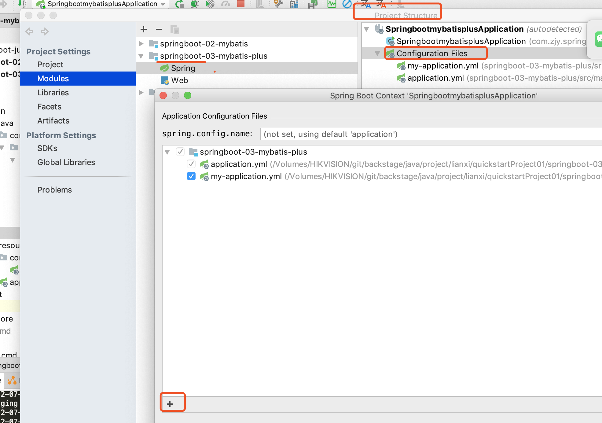

### 如果idea的maven加载成功，但external libraries没有，可能是maven_repository中包有异常，需要收到删除重新import

### item "tracker_server" in fdfs_client.conf not found 
解决重新maven

# 如何配置application.yml提示
- 在正常的情况下，// 
-  
  
  
