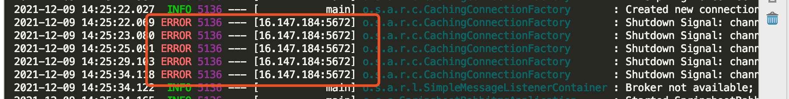

# rabbitmq的理解
生产者不停的发送消息到队列中，消费者（可以有多个）不停的消费消息，消费的过程中，有效后顺序，可能出现有的消息没有消费交给其他消费者消费，保证没有遗漏的消息；也可以设置指定的时间后消费；
# 消息应答
分为手动应答和自动应答，手动应答分为：批量应答和非批量应答；（multiple）
# 队列异常
rabbitmq中没有队列，先执行发送创建队列，在消费；
# 持久化
消息持久化（生产者发布时，MessageProperties.PERSISTENT_TEXT_PLAIN添属性）和队列持久化（durable：true）
# 分发方式
分为：公平轮询分发和不公平分发；
```java
// 在消费端设置不公平分发 也可以设置预取值
int prefetchCount = 1;
channel.basicQos(prefetchCount);
// 采用手动应答
boolean autoAck = false;
channel.basicConsume(TASK_QUEUE_NAME, autoAck, deliverCallback, (consumerTag) -> {
    System.out.println(consumerTag + "消费者取消消费接口回调逻辑");
});
```

# exchange、routingkey、queue
交换机绑定routingkey
队列绑定交换机和routingkey
一个队列发送的消息只能被消费一次
一个交换机可以有多个队列，一个消息就可以通过多个队列多次消费；
队列只对交换机感兴趣，交换类型hanout direct topic
topic中，当一个队列绑定键是#,那么这个队列将接收所有数据，就有点像fanout了，
如果队列绑定键当中没有#和*出现，那么该队列绑定类型就是direct了

# 如何成为死信进入死信队列
三大来源：1、消息被拒后，进入死信队列；2、超过设置过期的时间（TTL过期）没有被消费，进入死信队列；3、超出限制的最大接收消息数，剩下的都会进入死信队列；

# @Configuration在rabbitmq中起到初始化的作用
一启动初始化交换机、队列、及其相关routing-key和binding,一旦修改配置就会报错，需要重新手动去rabbitmq控制台中删除相关queue，然后重新启动，生成
新的交换机和队列


# 轮询
- RabbitMQ 将按顺序将每条消息发送给下一个消费者。平均而言，每个消费者将获得相同数量的消息。这种分发消息的方式称为轮询
# 消息确认
消费者发回确认（确认）以告诉 RabbitMQ 已接收、处理特定消息；即使消费者死亡，任务也不会丢失
# 消息持久性
RabbitMQ服务器停止，我们的任务仍然会丢失。

# 公平调度

# 绑定
需要告诉交换器向我们的队列发送消息。交换和队列之间的这种关系称为绑定。

