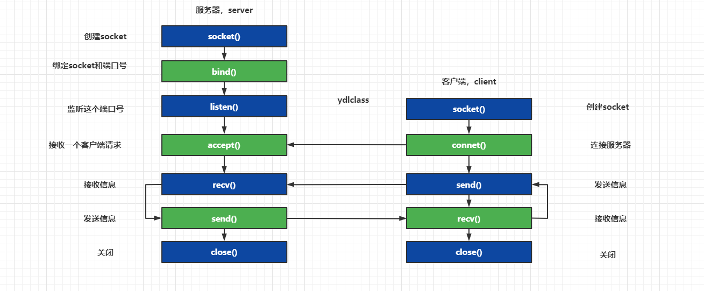

客户端和服务器现在可以通过对 Socket 对象的写入和读取来进行通信。
主机名和域名的联系与区别如下：
1、Internet域名是Internet网络上的一个服务器或一个网络系统的名字,在全世界,没有重复的域名。域名的范围要比主机名大。一个域名下可以有多个主机名,域名下还可以有子域名。例如,域名cnwg.cn下,有主机server1和server2,其主机全名就是server1.cnwg.cn和server2.cnwg.cn
2、主机名的含义是机器本身的名字，域名是方面记录IP地址才做的一种IP映射；二者有共性：都能对应到一个唯一的IP上，从应用场景上可以这么简单理解二者的区别：主机名用于局域网中；域名用于公网中。
127.0.0.1是保留地址之一，只是被经常的使用，来检验本机TCP/IP协议栈而已。如果我们可以ping通的话，就说明：本机的网卡和IP协议安装都没有问题。

# InetAddress的使用

URL（Uniform Resource Locator）资源定位符
URL 解析：
协议为(protocol)：https,主机为(host:port)：down.qq.com,端口号为(port);文件路径为(path);
本地文件也可以使用URL来表示： file:///D:/a.txt

注意客户端和服务器端都有一个 Socket 对象，所以无论客户端还是服务端都能够调用这些方法。
Addresses:用作主机标识符或套接字端点标识符;
InetAddress类该类表示一个Internet协议(IP)地址。

Sockets是通过网络在机器之间建立通信链路的手段;
Socket是一个TCP客户端API，通常用于连接到远程主机。 
ServerSocket是一个TCP服务器API，通常会接受来自客户端套接字的连接。 
DatagramSocket是一个UDP端点API，用于发送和接收数据报包。 
MulticastSocket是DatagramSocket的一个子类，用于处理多播组。
TCP sockets 的发送和接收是通过InputStreams和OutputStreams完成的，可以通过Socket.getInputStream()和Socket.getOutputStream()方法获得。

高级api(java.net)
URI是表示通用资源标识符的类，在RFC 2396中指定。顾名思义，这只是一个标识符，并不直接提供访问资源的方法。 
URL是表示通用资源定位器的类，它既是uri的旧概念，也是访问资源的一种方法。
URLConnection是从URL创建的，是用于访问URL指向的资源的通信链接。这个抽象类将把大部分工作委托给底层协议处理程序，如http或https。 
HttpURLConnection是URLConnection的子类，提供了一些特定于HTTP协议的附加功能。这个API已经被更新的HTTP客户端API所取代。 
建议使用URI来标识资源，然后在访问资源时将其转换为URL。从该URL，您可以获得URLConnection以进行更好的控制，也可以直接获得InputStream。

服务器与客户端的socket连接
