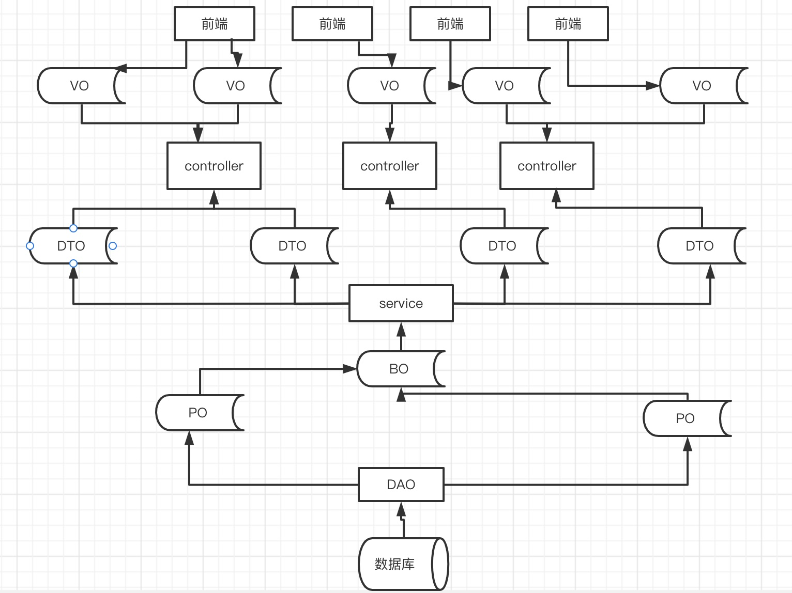

# 区别
VO（Value Object）值对象:页面展示字段
DTO（Data Transfer Object）数据传输对象
BO（Business Object）业务对象
PO（Persistant Object）持久对象:数据库中的记录

BO（Business Object）业务对象
主要作用是把业务逻辑封装为一个对象，这个对象可以包括一个或多个其他的对象。比如一份简历，有教育经历、工作经历、社会关系等。可以把教育经历对应一个 PO，工作经历对应一个 PO，社会关系对应一个 PO，然后建立一个对应建立的 BO来处理简历，每个 BO 包含这些 PO，这样就可以针对 BO 去处理业务逻辑。

DAO（Data Access Object）数据访问对象
此对象用于访问数据库，通常与 PO 结合使用，DAO 中包含了各种数据库的操作方法，结合 PO 对数据库进行相关操作，处于业务逻辑与数据库资源中间，通过它可以把 POJO 持久化为 PO，用 PO 组装 VO、DTO。

DO（Domain Object）领域对象
从现实世界中抽象的业务实体。

DTO（Data Transfer Object）数据传输对象
用于远程调用等需要大量传输对象的地方，也可以泛指用于展示层与服务层之间的数据传输对象。

PO（Persistent Object）持久对象
可以看成是与数据库中的表映射的 Java 对象，最简单的 PO 就是对应数据库中某个表中的一条记录，多个记录可以用 PO 的集合，PO 中应该不包含任何对数据库的操作。

POJO（Plain Ordinary Java Object）简单无规则 Java 对象
纯的传统意义上的 Java 对象，就是说在一些表关系映射工具中，能够做到维护数据库表记录的持久化对象完全是一个符合 Java Bean 规范的纯 Java 对象，没有增加别的属性和方法。也可以理解成最基本的 Java Bean，只有属性字段及 setter 和 getter 方法。

VO（View Object）值对象
通常用于业务层之间的数据传递，和 PO 一样也是仅仅包含数据而已，是抽象出来的业务对象，PO 只能用在数据层，VO 用在表示层。
一个是阿里巴巴的开发手册中的定义
DO（ Data Object）这个等同于上面的PO
另一个是在DDD（Domain-Driven Design）领域驱动设计中
DO（Domain Object）这个等同于上面的BO
