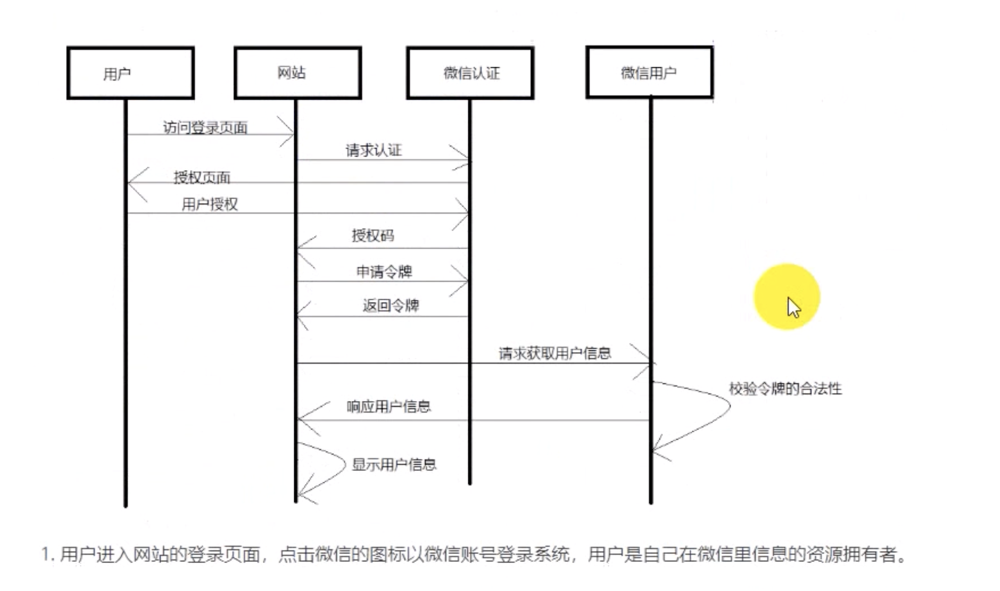
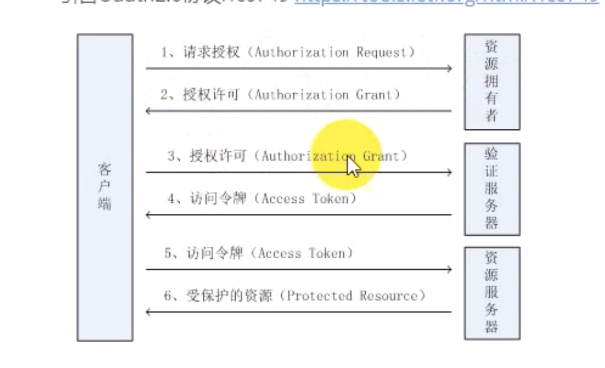
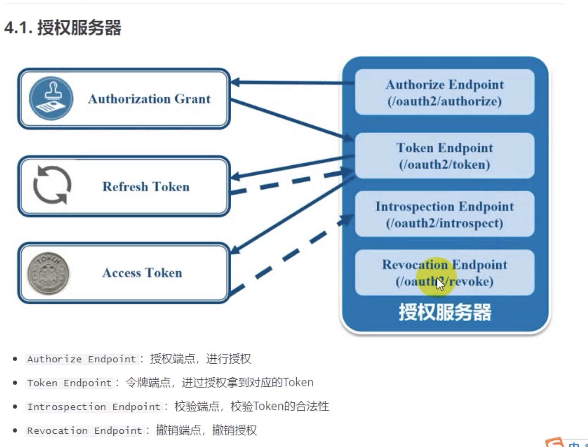
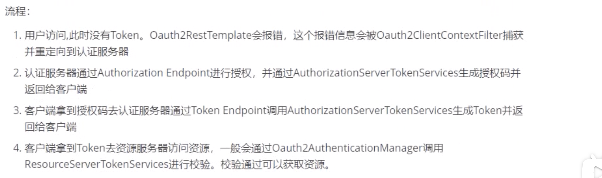

# 什么是单点登录
单点登录全称Single Sign On（以下简称SSO），是指在多系统应用群中登录一个系统，便可在其他所有系统中得到授权而无需再次登录，包括单点登录与单点注销两部分

# 登录功能的认证和授权的演化过程
## 单系统认证和授权
每一次浏览器请求服务器都会建立会话，会话机制是在第一请求服务器创建会话ID，浏览器存储会话id，并在后续请求中带上会话id，服务器取得请求中的会话id就知道是不是同一个用户；
服务器在内存中保存回话对象；
浏览器在cookie中保存，会话id标示不同的用户，并且在会话对象中标示登录状态（`session.setAttribute("isLogin", true)`）；

## 多系统的认证和授权
多个系统组成的应用群，单个系统的一一认证不可取，登录/注销只要一次就够了；
单系统登录解决方案的核心是cookie，cookie携带会话id在浏览器与服务器之间维护会话状态。但cookie是有限制的，这个限制就是cookie的域（通常对应网站的域名），浏览器发送http请求时会自动携带与该域匹配的cookie；
cookie的局限性：1、多系统不同域名（可以采用同域名共享cookie的方式）；2、各系统使用的web服务器技术相同，保持cookie键相同；3、不同语言的系统不行；4、cookie不安全；
`同域下的单点登录是巧用了Cookie顶域的特性，以及共享Session的解决方案，例如：Spring-Session来实现的。`
# 单点登录的必要条件
1、需要一个独立的认证中心，只有认证中心能接受用户的用户名密码等安全信息，其他系统不提供登录入口；
2、其他系统通过认证中心生成的令牌，实现登录授权，可以借此创建局部会话，局部会话登录方式与单系统的登录方式相同；

## 不同域下的单点登录实现原理
sso采用客户端/服务端架构，我们先看sso-client与sso-server要实现的功能（下面：sso认证中心=sso-server）

### sso-client
- 拦截子系统未登录用户请求，跳转至sso认证中心
- 接收并存储sso认证中心发送的令牌
- 与sso-server通信，校验令牌的有效性
- 建立局部会话
- 拦截用户注销请求，向sso认证中心发送注销请求
- 接收sso认证中心发出的注销请求，销毁局部会话
- 
### sso-server
- 验证用户的登录信息
- 创建全局会话
- 创建授权令牌
- 与sso-client通信发送令牌
- 校验sso-client令牌有效性
- 系统注册
- 接收sso-client注销请求，注销所有会话

# Oauth2
## 微信登录认证
；
## Oauth2认证流程：
;
### 客户端
本身不存储资源，需要通过资源拥有者的授权去请求服务器的资源，比如： Android客户端、web端（浏览器）、微信客户端等。
### 资源拥有者
通常为用户，也可以是应用程序，即该资源的拥有者。
### 授权服务器（认证服务器）
用来对资源拥有的身份进行认证、对访问资源进行授权。客户端要想访问资源需要通过认证服务器由资源拥有者授权后方可访问。

### 资源服务器
存储资源的服务器，比如，网站用户管理服务器存储了网站用户信息，网站相册服务器存储了用户的相册信息，微信的资源服务存储了微信的用户信息等。客户端最终访问资源服务器获取资源信息。

### 常用术语：
客户凭证（client credentials）：客户端的client 和密码用于认证客户；
令牌（tokens）：授权服务器在接收到客户请求后，颁发的访问令牌。
作用域（scopes）: 客户请求访问令牌时，有资源拥有者额外指定的细分权限（permission）；
认证： 判断一个用户的身份是否合法的过程；
会话：用户认证通过后，为了避免用户的每次操作都进行认证可将用户的信息保证在会话中。会话就是系统为了保持当前用户的登录状态所提供的机制，常见的有基于session方式、基于token方式等；
授权：更细粒度的对隐私数据进行划分，授权是在认证通过之后发生的，控制不同的用户能够访问不同的资源。
资源：功能资源和数据资源（资源类型、资源实例）

### 令牌类型：
授权码： 仅用于授权码授权类型，用于交换获取访问令牌和刷新令牌；
访问令牌： 用于代表一个用户或服务直接去访问受保护的资源；
刷新令牌： 用于区授权服务器获取一个刷新访问令牌；
BearerToken: 不管谁拿到token都可以访问资源；
Proof of Possession(PoP) Token: 可以检验client是否对Token有明确的拥有权；

### 授权模式
- 授权码模式
- 简化授权模式
- 密码模式
- 客户端模式
- 刷新令牌模式
  
### 

;
;

# cookie Auth (cookie授权)
Cookie认证机制就是第一次请求认证在服务器端创建一个Session 对象，同时在客户端的浏览器创建一个Cookie对象，通过客户端带上来的Cookie对象来与服务器端的Session对象匹配来实现状态管理的。
默认的，当我们关闭浏览器的时候，cookie会被删除，但可以通过修改cookie的expire time使cookie在一定时间内有效。
# oAuth Auth (Oauth授权)
俗称第三方登录授权
# Token Auth（token授权）
1.客户端使用用户名跟密码请求登录
2.服务端收到请求，去验证用户名和密码
3.验证成功后，服务端回签发一个token，在把这个token发送给客户端；
4.客户端收到token以后可以把它存储起来，比如放在cookie里
5.客户端再次向服务端请求的时候需要带着服务端签发的Token；
6.服务端收到请求，然后去验证客户端请求里面带着的token，如果验证成功，就像客户端返回请求的数据；

