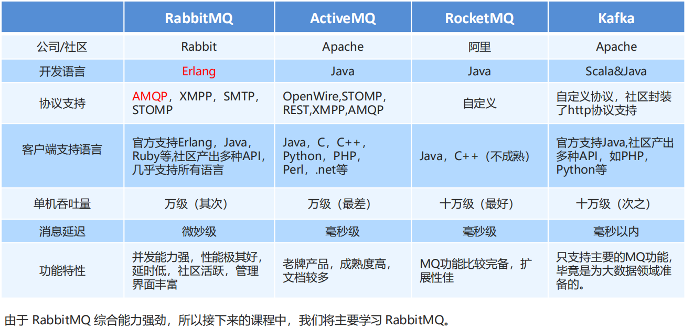
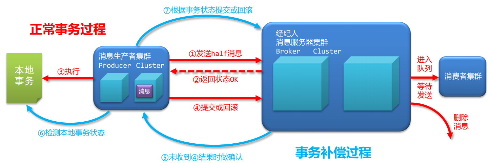

# MQ作用
## 优势
`应用解耦`:提高系统的容错性和可维护性，消息的生产者发送消息，消费者消费消息，生产者发送消息后就去做其他事情；
`异步提速`:用户体验和系统吞吐量，生产者发送消息后就返回前端通知用户，后续的消费消息是异步的；
`削峰填谷`:使用mq，限制消费消息的速度，高峰期消息都被挤压在MQ中（削峰）不会压垮数据库，高峰过后，还是按照原来的速度消费消息（填谷），将待消费的消息消费完。可以调高系统的稳定性；
## 劣势：
1.系统的可用性降低，引入外部依赖，系统的稳定性降低了，如何保证高可用！
2.系统的复杂度提高了，以前是同步远程调用，现在是异步调用，如何保证消息不被重复消费，怎样处理消息丢失，保证消息传递的顺序性；
3.一致性问题，A系统处理业务，MQ转发给B、C、D而其中D出现异常，产生了数据的一致性问题；
什么时候用MQ
① 生产者不需要从消费者处获得反馈。引入消息队列之前的直接调用，其接口的返回值应该为空，这才让明 明下层的动作还没做，上层却当成动作做完了继续往后走，即所谓异步成为了可能。② 容许短暂的不一致性.③ 确实是用了有效果。即解耦、提速、削峰这些方面的收益，超过加入MQ，管理MQ这些成本、
#2、AMQP 和 JMS
MQ是消息通信的模型；实现MQ的大致有两种主流方式：AMQP、JMS。
`AMQP`:AMQP是一种协议，更准确的说是一种binary wire-level protocol（链接协议）。这是其和JMS的本质差别，AMQP不从API层进行限定，而是直接定义网络交换的数据格式。`JMS`:JMS即Java消息服务（JavaMessage Service）应用程序接口，是一个Java平台中关于面向消息中间件（MOM）的API，用于在两个应用程序之间，或分布式系统中发送消息，进行异步通信。
# AMQP 与 JMS 区别
JMS是定义了统一的接口，来对消息操作进行统一；AMQP是通过规定协议来统一数据交互的格式,JMS限定了必须使用Java语言；AMQP只是协议，不规定实现方式，因此是跨语言的。
JMS规定了两种消息模式；而AMQP的消息模式更加丰富。
# NON_PERSISTENT模式和 PERSISTENT模式
对于非持久的消息，JMS provider不会将它存到文件/数据库等稳定的存储介质中。也就是说非持久消息驻留在内存中，如果jms provider宕机，那么内存中的非持久消息会丢失。A JMS provider must diliver a NON_PERSISTENT message at-most-once 。对于持久消息，消息提供者会使用存储-转发机制，先将消息存储到稳定介质中，等消息发送成功后再删除。如果jms provider挂掉了，那么这些未送达的消息不会丢失；jms provider恢复正常后，会重新读取这些消息，并传送给对应的消费者。 A JMS provider must diliver a PERSISTENT message once -and-only-once
# MQ产品介绍
ActiveMQ:基于JMS,java语言实现，万级数据吞吐量，处理速度ms级，主从架构，成熟度高
ZeroMQ：基于C语言开发
RabbitMQ: erlang语言实现，万级数据吞吐量，处理速度us级，主从架构，
RocketMQ: 基于AMQP协议，erlang语言开发，稳定性好,java语言实现，十万级数据吞吐量，处理速度ms级，分布式架构，功能强大，扩展性强
kafka: scala语言实现，十万级数据吞吐量，处理速度ms级，分布式架构，功能较少，应用于大数据较多
;
RocketMQ
RocketMQ是阿里开源的一款非常优秀中间件产品，脱胎于阿里的另一款队列技术MetaQ，后捐赠给Apache基金会 作为一款孵化技术，仅仅经历了一年多的时间就成为Apache基金会的顶级项目。并且它现在已经在阿里内部被广泛 的应用，并且经受住了多次双十一的这种极致场景的压力（2017年的双十一，RocketMQ流转的消息量达到了万亿 级，峰值TPS达到5600万）
# 原理
producer向命名服务器集群发消息获取broker的ip，然后向broker集群发消息，consumer向命名服务器集群发消息获取ip,与broker建立长连接，
消息发送
One-To-One（基础发送与基础接收）
One-To-Many（负载均衡模式与广播模式）
```java
BROADCASTING("BROADCASTING"),
CLUSTERING("CLUSTERING");
consumer.setMessageModel(MessageModel.BROADCASTING);
```
Many-To-Many
单生产者多消费者消息发送（OneToMany）
消费者（广播模式,集群模式）
多生产者多消费者消息发送（ManyToMany）
多生产者产生的消息可以被同一个消费者消费，也可以被多个消费者消费
#  消息类别
1.同步消息
即时性较强，重要的消息，且必须有回执的消息，例如短信，通知（转账成功）；
```java
producer.send(msg);
```
2.异步消息
即时性较弱，但需要有回执的消息，例如订单中的某些信息
```java
producer.send(msg, new SendCallback() {});
```
3.单向消息
不需要有回执的消息，例如日志类消息
```java
producer.sendOneway(msg);
```
4.延时消息
消息发送时并不直接发送到消息服务器，而是根据设定的等待时间到达，起到延时到达的缓冲作用
```java
Message msg = new Message("topic3",("延时消息：hello rocketmq "+i).getBytes("UTF-8"));
//设置延时等级3,这个消息将在10s之后发送(现在只支持固定的几个时间,详看delayTimeLevel)
// private String messageDelayLevel = "1s 5s 10s 30s 1m 2m 3m 4m 5m 6m 7m 8m 9m 10m 20m 30m 1h 2h";
msg.setDelayTimeLevel(3);
SendResult result = producer.send(msg);
```
5.批量消息
批量发送消息能显著提高传递小消息的性能.
批量消息的限制条件：
1这些批量消息应该有`相同的topic`
2相同的waitStoreMsgOK
3`不能是延时消息`
4消息内容总长度`不超过4M`
​ 消息内容总长度包含如下：
​ topic（字符串字节数）
​ body （字节数组长度）
​ 消息追加的属性（key与value对应字符串字节数）
​ 日志（固定20字节）
```java
SendResult result = producer.send(msgList);
```
# 消息过滤
1.按照tag过滤信息;
```java
//发送消息
Message msg = new Message("topic6","tag2",("消息过滤按照tag：hello rocketmq 2").getBytes("UTF-8"));
//接收消息，除了制定topic，还可以指定接收的tag,*代表任意tag
consumer.subscribe("topic6","tag1 || tag2");
```
2.语法过滤（属性过滤/SQL过滤）
基本语法
数值比较，比如：>，>=，<，<=，BETWEEN，=；
字符比较，比如：=，<>，IN；
IS NULL 或者 IS NOT NULL；
逻辑符号 AND，OR，NOT；
常量支持类型为：
数值，比如：123，3.1415；
字符，比如：'abc'，必须用单引号包裹起来；
NULL，特殊的常量
布尔值，TRUE 或 FALSE
```java
//生产者，为消息添加属性
msg.putUserProperty("vip","1");
msg.putUserProperty("age","20");
// 消费者，使用消息选择器来过滤对应的属性，语法格式为类SQL语法
consumer.subscribe("topic7", MessageSelector.bySql("age >= 18"));
consumer.subscribe("topic6", MessageSelector.bySql("name = 'litiedan'"));
```
`SQL过滤需要依赖服务器的功能支持，在broker.conf配置文件中添加对应的功能项，并开启对应功能（enablePropertyFilter=true）`
# springboot整合
```pom
<dependency>
    <groupId>org.apache.rocketmq</groupId>
    <artifactId>rocketmq-spring-boot-starter</artifactId>
    <version>2.0.3</version>
</dependency>
```
```yml
rocketmq.name-server=localhost:9876
rocketmq.producer.group=demo_producer
```
```java
@RestController
public class DemoProducers {
    @Autowired
    private RocketMQTemplate template;
    @RequestMapping("/producer")
    public String producersMessage() {
        User user = new User("sharfine", "123456789");
        template.convertAndSend("demo-topic", user);
        // 单向消息
        // rocketMQTemplate.sendOneWay("topic9",user);
        // 延时消息
        // rocketMQTemplate.syncSend("topic9", MessageBuilder.withPayload("test delay").build(),2000,2);
        // 异步消息
        // rocketMQTemplate.asyncSend("topic9", user, new SendCallback() {

        return JSON.toJSONString(user);
    }
}
@Service
// @RocketMQMessageListener(topic = "topic9",consumerGroup = "group1",messageModel = MessageModel.BROADCASTING, selectorExpression = "tag1",selectorExpression = "age>18",selectorType= SelectorType.SQL92)
@RocketMQMessageListener(topic = "demo-topic", consumerGroup = "demo_consumer")
public class DemoConsumers1 implements RocketMQListener<user> {
    @Override
    public void onMessage(user user) {
        System.out.println("Consumers1接收消息:" + demoEntity.toString());
    }
}
```
# 消息的特殊处理
消息有序指的是可以按照消息的发送顺序来消费(FIFO)。RocketMQ可以严格的保证消息有序，可以分为分区有序或者全局有序。
顺序消费的原理解析，在默认的情况下消息发送会采取Round Robin轮询方式把消息发送到不同的queue(分区队列)；而消费消息的时候从多个queue上拉取消息，这种情况发送和消费是不能保证顺序。但是如果控制发送的顺序消息只依次发送到同一个queue中，消费的时候只从这个queue上依次拉取，则就保证了顺序。当发送和消费参与的queue只有一个，则是全局有序；如果多个queue参与，则为分区有序，即相对每个queue，消息都是有序的。（队列内有序，队列外无序）
```java
//发送时要指定对应的消息队列选择器
            SendResult result = producer.send(msg, new MessageQueueSelector() {
                //设置当前消息发送时使用哪一个消息队列
                public MessageQueue select(List<MessageQueue> list, Message message, Object o) {
                    //根据发送的信息不同，选择不同的消息队列
                    //根据id来选择一个消息队列的对象，并返回->id得到int值
                    long orderId = order.getOrderId();
                    long mqIndex = orderId % list.size();
                    return list.get((int) mqIndex);
                }
            }, null);
//使用单线程的模式从消息队列中取数据，一个线程绑定一个消息队列
		consumer.registerMessageListener(new MessageListenerOrderly() {
            //使用MessageListenerOrderly接口后，对消息队列的处理由一个消息队列多个线程服务，转化为一个消息队列一个线程服务
            public ConsumeOrderlyStatus consumeMessage(List<MessageExt> list, ConsumeOrderlyContext consumeOrderlyContext) {
                for (MessageExt msg : list) {
                    System.out.println(Thread.currentThread().getName()+"。消息：" + new String(msg.getBody())+"。queueId:"+msg.getQueueId());
                }
                return ConsumeOrderlyStatus.SUCCESS;
            }
        });
```
# 事务消息
- 正常事务过程
- 事务补偿过程

- 事务消息状态
提交状态：允许进入队列，此消息与非事务消息无区别
回滚状态：不允许进入队列，此消息等同于未发送过
中间状态：完成了half消息的发送，未对MQ进行二次状态确认
注意：`事务消息仅与生产者有关，与消费者无关`


