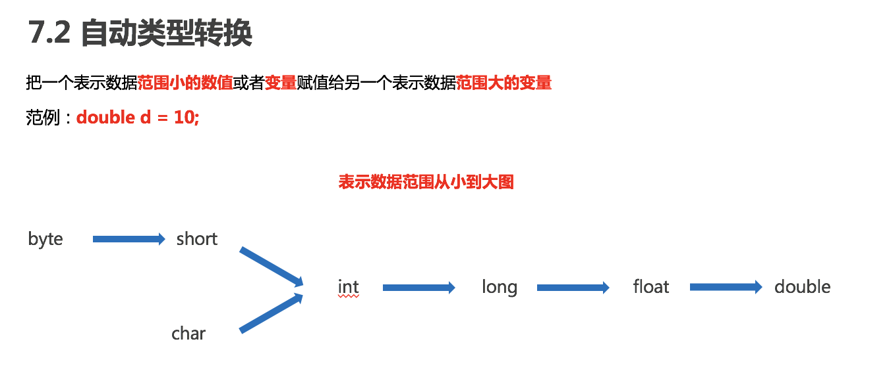

# 语法
## 基础语法
### 注释
单行注释 多行注释 文档注释
- 注释是在程序指定位置添加的说明性信息注释是在程序指定位置添加的说明性信息
- 注释不参与程序运行，仅起到说明作用

### 关键字
- 关键字就是被Java语言赋予了特定含义的单词。
- - 关键字的字母全部小写
- - 常用的代码编辑器，针对关键字有特殊的颜色标记，非常直观。

### 常量
- 常量：在程序运行过程中，其值不可以发生改变的量
- 常量分类 


### 数据类型

存储单位，大家比较熟悉，我们一起来看看：
1B（字节） = 8bit  # bit（位）
1KB = 1024B
1MB = 1024KB
1GB = 1024MB
1TB = 1024GB


### 变量
- 变量：在程序运行过程中，其值可以发生改变的量。
- 从本质上讲，变量是内存中一小块区域。
- 格式：数据类型 变量名 = 变量值; 范例：int a = 10;
- 变量不能重复，并尚未初始化变量不能使用

### 标识符
- 标识符：就是给类，方法，变量等起名字的符号
- 规则：
  - 由数字、字母、下划线(_)和美元符($)组成
  - 由数字、字母、下划线(_)和美元符($)组成
  - 不能以数字开头
  - 不能是关键字
  - 区分大小写
- 常见命名约定
  - 小驼峰命名法：方法、变量
  - 大驼峰命名法：类

### 类型转换
- 类型转换分类
    - 自动类型转换
      -  
    - 强制类型转换
      - 把一个表示数据范围大的数值或者变量赋值给另一个表示数据范围小的变量
      - 格式：目标数据类型 变量名 = (目标数据类型)值或者变量;
      - 范例：int k = (int)88.88;

### 运算符
- 算数运算符
- 赋值运算符
- 三元运算符
- 关系运算符
- 逻辑运算符
- 自增自减运算符

### 流程控制
- 流程控制语句分类
  - 顺序结构
  - 分支结构 （if, switch）
  - 循环结构  (for, do while, while)
  
```java
int num = 3;

switch (num) {
    case 1:
    case 2:
    case 3:
        System.out.println(1);
        break;
    case 4:
        System.out.println(2);
        break;
    default:
        System.out.println("default");

}
```

- **continue**	用在循环中，基于条件控制，跳过某次循环体内容的执行，继续下一次的执行
- **break**	用在循环中，基于条件控制，终止循环体内容的执行，也就是说结束当前的整个循环


