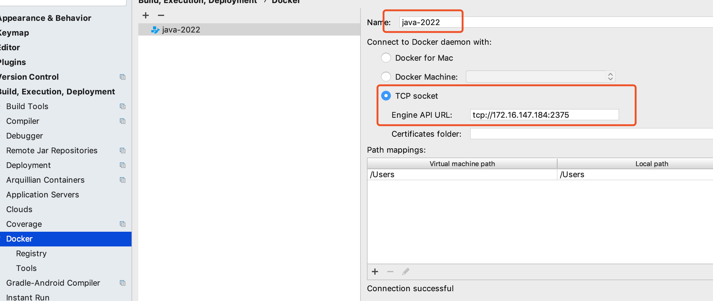

# Docker开启远程访问
sftp root@172.16.147.182
## 修改Docker服务文件
- vi /lib/systemd/system/docker.service
## 修改ExecStart这行
- ExecStart=/usr/bin/dockerd -H tcp://0.0.0.0:2375 -H unix:///var/run/docker.sock
## 重新加载配置文件
- systemctl daemon-reload
## 重启服务
- systemctl restart docker.service

# idea安装docker插件


# docker-maven-plugin
传统过程中，打包、部署等；
在持续集成过程中，项目工程一般使用maven编译打包，然后生成镜像，通过镜像上线，能够大大提供上线效率，同时能够快速动态扩容，快速回滚，着实很方便。docker-maven-plugin插件就是为了帮助我们在maven工程中，
通过简单的配置，自动生成镜像并推送到仓库中；
```pom
<properties>
<!-- 镜像名称 -->
    <docker.image.prefix>spring-boot-thym</docker.image.prefix>
</properties>

<build>
    <plugins>
        <plugin>
            <groupId>org.springframework.boot</groupId>
            <artifactId>spring-boot-maven-plugin</artifactId>
            <version>1.0.0</version>
        </plugin>
        <plugin>
            <groupId>com.spotify</groupId>
            <artifactId>docker-maven-plugin</artifactId>
            <version>1.0.0</version>

            <configuration>
            <!-- 镜像名称  -->
                <imageName>${docker.image.prefix}/${project.artifactId}</imageName>
<!-- 指定标签 -->
                <imageTags>
                    <imageTag>latest</imageTag>
                </imageTags>
                <!-- 基础镜像jdk 8 -->
                <baseImage>java</baseImage>
                <!-- 制作者提供本人信息 -->
                <maintainer>1020066395@qq.com</maintainer>
                <!-- 切换到/ROOT目录 -->
                <workdir>/ROOT</workdir>
                <cmd>["java","-version"]</cmd>
                <!-- 启动架包的名称 -->
                <entryPoint>["java","-jar","${project.build.finalName}.jar"]</entryPoint>
                <!-- <dockerDirectory>${project.basedir}/src/main/docker</dockerDirectory> -->
                <!-- 指定远程docker 远程服务器 -->
                <dockerHost>http:172.16.147.184:2375</dockerHost>
                <!-- 这里是复制jar包到docker容器指定目录配置 -->
                <resources>
                    <resource>
                        <targetPath>/ROOT</targetPath>
                        <!-- 用于指定需要复制的根目录  ${project.build.directory}表示target目录-->
                        <directory>${project.build.directory}</directory>
                        <!-- 指定需要复制的文件，指定打包后的jar包文件 -->
                        <include>${project.build.finalName}</include>
                    </resource>
                </resources>
            </configuration>
        </plugin>
    </plugins>
</build>
```