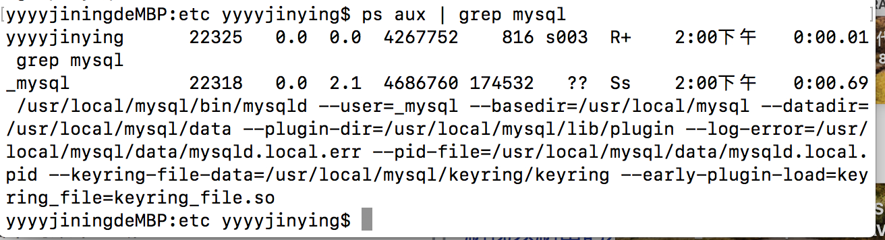

## mysql数据库管理系统
- mysqlId 服务器进程
- mysql.server 服务器启动脚本
- mysqlbug 缺陷报告脚本
- show variables like 'character%'

## mysql安装
- 下载指定的版本，mysql commnity server  [下载地址](https://downloads.mysql.com/archives/community/)
- 下载指定的jdbc接口 [MySQL Connector/J地址](https://downloads.mysql.com/archives/c-j/)

## 登录命令
- mysql -u root -p 123456
- 修改root密码方法：SET PASSWORD FOR 'root'@'localhost' = PASSWORD('root')
- 立即刷新生效：flush privileges
## 服务操作命令
- service mysql start|stop|restart|status
  

## ps aux | grep mysql 查看mysql数据库是否开启服务
  

  - MySQL写入到环境变量中,
 
    ```js 
    vim ~/.bash_profile
    ```
## mysql配置linux
- groupadd mysql
- useradd -r -g mysql mysql
- cd /usr/local/mysql
- chgrp -R mysql .
- chown -R mysql .
- ls /etc/my.cnf
- rm -rf /etc/my.cnf
- ./scripts/mysql_install_db --user=mysql

- cp support-files/mysql.server /etc/rc.d/init.d/mysql
- ln -s /usr/local/mysql/bin/mysql /usr/bin/mysql
A temporary password is generated for root@localhost: CZTgnub.x3RP

  

  