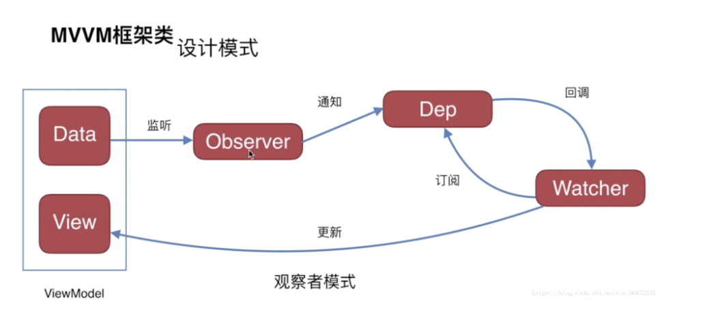

# node的事件驱动的非阻塞异步I/O
nginx采用C编写
既可以接受并发请求，也可以发送并发请求；
1.用户体验异步，一个资源的获取不会阻塞另一个资源，事件总消耗是max(m,n);
2.资源分配
- 单线程串行之行，多线程并行完成；
- 多线程代价：在于创建线程和执行期线程上下文切换的开销大；锁、状态同步的问题；多核CPU提高了利用率；
- 单线程：顺序思考的思维方式；性能差，代码执行阻塞；
- node给出方案，利用异步I/O使单线程远离阻塞；力求在单线程上将资源分配得更高效；
- 单线程无法高效利用多核CPU；node采用workers子进程；

# 执行环境和作用域
执行环境（excution context）:最用重要的一个概念；
每个执行环境都有一个与之关联的变量对象（variable Object),保存着所有的变量和函数，（编写的代码无法访问该对象，但解析器会会在后台使用它）
每个函数都有自己的执行环境，当执行流进入一个函数，会把函数的环境推入一个环境栈中，在函数执行完之后，栈将其环境弹出（该环境销毁及其变量函数都销毁），将控制权返回给之前的执行环境。
执行环境中会创建一个变量对象的作用域链（作用：保证对执行环境中变量和函数的有序访问），
作用域链前端是当前执行环境的变量对象；
下一个变量对象是来自下一个包含环境；


# 事件循环
Loash.为了解决javascript单线程阻塞的问题，引入了事件循环；
在进程启动时，会创建一个类似于while（true）的循环，每执行一次循环体的过程称为tick，
在tick中，每个事件循环中有一个或多个观察者，向这些观察者询问是否有要处理的事件；
如果有，就取出事件及其相关的回调函数，执行他们；然后进入下一个循环，如果不再有事件
处理，就退出进程。
事件循环是一个典型的生产者/消费者模型。异步I/O、网络请求等则是事件的生产者，
这些提供的事件被传递给对应的观察者，事件循环就是从观察者那里取出事件并处理。

## 每一次 tick 的任务处理模型是比较复杂的，但关键步骤是：
1、执行一个宏任务（栈中没有就从宏任务队列中获取）
2、执行过程中遇到微任务，就将它添加到微任务的任务队列中
3、宏任务执行完毕，立即执行当前微任务队列中的所有微任务（依次执行）
4、当前所有微任务执行完毕后，开始检查渲染，GUI 线程接管渲染
5、渲染完毕后，JS 引擎继续开始下一个宏任务，从宏任务队列中获取

异步、非阻塞、事件、回调；
事件： 网络请求、用户点击、加载文件等；

## 任务队列
根据规范，事件循环是通过任务队列的机制来进行协调的。
一个 Event Loop 中，可以有一个或者多个任务队列(task queue)，
一个任务队列便是一系列有序任务(task)的集合；每个任务都有一个任务源(task source)，
源自同一个任务源的 task 必须放到同一个任务队列，从不同源来的则被添加到不同队列。
setTimeout/Promise 等API便是任务源，而进入任务队列的是他们指定的具体执行任务。

### 宏任务包含：
script(整体代码)
setTimeout
setInterval
I/O
UI交互事件
postMessage
MessageChannel
setImmediate(Node.js 环境)

### 微任务包含：
Promise.then
Object.observe
MutationObserver
process.nextTick(Node.js 环境)

# 异步API
setTimeout()和setInterval(),单次和多次定时执行任务；
调用setTimeout()和setInterval（）时，创建的定时器会被插入到定时器观察者内部的一个红黑树中；
每次tick执行，会从该红黑树中迭代取出定时器对象，检查是否超过定时间，如果超过就形成一个事件，
它的回调函数立即执行；setInterval定时器重复性的检测和执行；
process.nextTick()只会将回调函数放入异步队列，在下一个tick取出执行；
红黑树的复杂度比队列高，队列更高效；

# 高阶函数
把函数作为参数，或者将函数作为返回值的函数。forEach(),map(),reduce(),filter(),every(),some()

# Promise/Deferred模式。// 预期/承诺/延迟
使用事件的方式时，执行流程需要被预先设定。
Deferred主要是用于内部，用于维护异步模型的状态（未完成状态，完成状态resolve，失败状态reject），Promise则作用与外部，通过then()方法暴漏给外部添加自定义逻辑；
promise通过封装异步调用，实现正向用例和反向用例的分离以及逻辑处理延迟。使得回调函数相对优雅。

promise的all()方法，可以执行多个异步操作，只有所有的异步操作成功，才算成功，一旦其中一个异步操作失败，整个操作就失败。


# web缓存
软件架构经过C/S模式到B/S模式的演变，传统的客户端仅仅需要传输数据，而web应用需要传输构成界面的组件（javascript、html、css文件等），
这部分内容在大多数情况下并不经常变更，却需要向客户端传递，不进行缓存，会造成不必要的带宽的浪费；
如果网络传输慢，需要花费更多时间才能打开；
web缓存的优点还有很多： - 减轻服务器压力 - 减少数据传输，节省网络带宽和流量 - 缩短页面加载时间，提升用户体验
为了提高性能，关于缓存的规则有：
1、添加Expires或Cache-control到报文头中。
2、配置ETag
3、
## 数据库缓存
一般常见的web应用，特别是复杂的大型应用，数据库的数据表众多，数据量大，在做数据查询时需要花费一定的时间和大量的性能，
所以为了避免频繁的数据查询，数据库服务器会将查询到的数据暂存在内存中，下次有相同数据查询时可以直接从内存中返回，极大的提高了性能和效率。常见的数据库缓存技术有memcache和redis。

## 服务器缓存
又称为缓存代理服务器或者代理缓存，是存在于客户端和源服务器之间的一种中间服务器，这种代理服务器接收多个客户端的数据请求，属于公有缓存，
这种缓存能大量减少多个客户端相同的资源请求，有效降低源服务器的负载压力。

## 浏览器缓存
### 1.HTTP协议缓存
post\delete\put这类带行为性的请求不做缓存，大多数缓存只应用于get请求；
浏览器根据http协议头部的特殊控制字段来控制资源缓存的机制
http1.0使用Expires这个过期日期之前都可以直接使用缓存
http1.1使用Cache-Control: 更细粒度的控制是否可以缓存，可选值如下
Cache-Control用于控制缓存和缓存时间（Cache-Control: no-cache,max-age=3600），
Last-Modified和Etag用于缓存过期时，与服务器做验证，优先判断Etag，
如果Etag的值相同会继续判断Last-Modified，最后才决定是返回200还是304状态
缓存的判断逻辑是：
本地是否有文件-》是否可用-〉采用本地文件（采用新文件）
### 2.Web Storage
cookie存储数据的大小被限制在4K；
Web Storage分为两种，即sessionStorage（页面会话期间可用）和localStorage（浏览器关闭，然后重新打开后数据仍然存在）；
应用程序缓存（Cache Manifest） 机制，使得基于web的应用程序可以离线运行。

清除缓存：浏览器是根据url缓存的，跟随版本号或者hash值发起新的请求；

# px、em、rem区别介绍
## 在css中单位长度用的最多的是px、em、rem，这三个的区别是：
- px是固定的像素，一旦设置了就无法因为适应页面大小而改变。分辨率大的，看起来会变小；
- em和rem相对长度单位，em是相对于其父元素进行设置，所以都需要知道他父元素的大小；
- rem是相对于根元素<html>，只需要在根元素确定一个参考值；

### em
（一）子元素字体大小的em是相对于父元素字体大小
（二）元素的width/height/padding/margin用em的话是相对于该元素的font-size
### rem是全部的长度都相对于根元素，根元素<html>元素。通常做法是给html元素设置一个字体大小，然后其他元素的长度单位就为rem。

### 移动端的rem.js配置
1.根据设计稿的px,自动计算html-size 的大小；
```js
window.onload = function() {
  /*720代表设计师给的设计稿的宽度，你的设计稿是多少，就写多少;100代表换算比例，这里写100是
    为了以后好算,比如，你测量的一个宽度是100px,就可以写为1rem,以及1px=0.01rem等等
    html-size = clientWidth/设计稿的宽度 * 100 + "px";
    */
  getRem(720, 100);
};
window.onresize = function() {
  getRem(720, 100);
};
function getRem(pwidth, prem) {
  var html = document.getElementsByTagName('html')[0];
  var oWidth = document.body.clientWidth || document.documentElement.clientWidth;
  html.style.fontSize = (oWidth / pwidth) * prem + 'px';
}
```
2.通过插件postcss-pxtorem轻松实现px到rem转换，完成移动端适配
```js
pxtorem({
    rootValue: 100, //表示根元素html的fontSize值,也可以是100,获取任意其他值
    propList: ['*'], //设置px转换成rem的属性值，*表示所有属性的px转换为rem
})
```


# 如何解决跨域
协议、域名、端口有一个不一致都会产生跨域；
- 端口和协议的不同，只能通过后台来解决

## 跨域限制
1、无法读取非同源网页的 Cookie、LocalStorage 和 IndexedDB
2、无法接触非同源网页的 DOM
3、无法向非同源地址发送 AJAX 请求（可以发送，但浏览器会拒绝接受响应）
## 如何解决跨域
1、jsonp跨域
- JSONP 只支持get请求、不支持post请求

2、nginx反向代理

- 

3、后端设置在网关中配置CorsWebFilter

- header(‘Access-Control-Allow-Origin:*’);//允许所有来源访问
- header(‘Access-Control-Allow-Method:POST,GET’);//允许访问的方法

4、document.domain【实现不同window之间的相互访问和操作】
```js
<iframe id = "iframe" src="http://example.com/b.html" onload = "test()"></iframe>
<script type="text/javascript">
    document.domain = 'example.com';//设置成主域
    function test(){
        alert(document.getElementById('iframe').contentWindow);//contentWindow 可取得子窗口的 window 对象
    }
</script>
```

5、postMessage
```js
// 发送消息 参数：1、字符串消息、2、URI
获取iframe的contextWindow.postMessage("Hello "+val+"！", "https://c.runoob.com");

// 通过监听 message 事件，接收消息
window.addEventListener('message', function (e) {
    if (e.origin !== "https://www.runoob.com") {  // 验证消息来源地址
        return;
    }
    messageEle.innerHTML = "从"+ e.origin +"收到消息： " + e.data;
});
```

# 反向代理
反向代理（Reverse Proxy）方式是指以代理服务器来接受Internet上的连接请求，然后将请求转发给内部网络上的服务器；并将从服务器上得到的结果返回给Internet上请求连接的客户端，此时代理服务器对外就表现为一个服务器。
反向代理需要用到nginx。反向代理是在服务器端进行处理。首先修改hosts文件，将域名指向开发者的电脑本身，把自己伪装成服务端，再通过nginx对不同的请求进行转发，把静态资源指向开发者本地电脑的资源，将接口指向实际的服务器。


# this.$nextTick()
Vue实现响应式并不是数据发生变化之后DOM立即变化，而是异步执行DOM更新的。
vue异步更新的原理：
1.修改 Vue 中的 Data 时，就会触发所有和这个 Data 相关的 Watcher 进行更新。
2.首先，开启一个异步队列，会将所有的 Watcher 加入队列 Queue，如果同一个 watcher 被多次触发，只会被推入到队列中一次。
3.然后，在下一个的事件循环“tick”中，vue 刷新队列并调用 nextTick 方法，执行异步任务。
4.在异步任务的回调中，对 Queue 中的 Watcher 进行排序，然后执行对应的 DOM 更新。


# vue的响应式原理
当你把一个普通的 JavaScript 对象传入 Vue 实例作为 data 选项，
Vue 将遍历此对象所有的 property，并使用 Object.defineProperty 把这些 property 全部转为 getter/setter。


# loader和plugin的区别
loader是文件加载器，运行在打包文件之前，loader为在模块加载时的预处理文件，如：语法编译解析、样式加载，配置的执行顺序是倒叙的；
plugin是在webpack运行的整个生命周期中会广播出许多事件，监听这些事件，在合适的时机中通过webpack提供的api改变输出结果；


# vue 的双向数据绑定
vue实现双向数据绑定的原理就是采用数据劫持结合发布者-订阅者模式的方式，
通过Object.defineProperty()
来劫持各个属性的setter，getter，在数据变动时发布消息给订阅者，触发相应的监听回调；


Observer（Objec.defineProperty中的set）监听data的变化，当data有变化的时候通知观察者列表Dep（里面有与data变化对应的update函数）,
watcher负责向观察者列表里添加（订阅）对应的更新函数，Dep里的更新函数执行完了之后将最新的值更新到view上。


# template 
vue中的模板template无法被浏览器解析并渲染，需要模板编译，
分三个阶段，解析parse，优化optimize，生成generate，最终生成可执行函数render。
parse阶段：解析器（parser）的作用是将 模板字符串 转换成抽象语法树AST。
optimize阶段：遍历抽象语法树AST，找到其中的一些静态节点并进行标记，方便在页面重渲染的时候进行diff比较时，直接跳过这一些静态节点，优化runtime的性能。
generate阶段：将最终的抽象语法树AST转化为完整的renader函数代码。


# 虚拟daom
Vue.js通过编译将模版转换成渲染函数(render)，执行渲染函数就可以得到一个虚拟DOM
在对模型进行操作的时候，会触发对应的Dep中的Watcher对象。Watcher对象会调用对应的update来修改视图。
这个过程主要是渲染函数生成虚拟DOM，将vnode渲染成真实的DOM，
这个过程是通过patching算法对比新旧虚拟节点之间有哪些不同，
然后根据对比结果找出需要更新的的节点进行更新。
Virtual DOM
是一棵以 JavaScript 对象( VNode 节点)作为基础的树，用对象属性来描述节点，
实际上它只是一层对真实 DOM 的抽象。最终可以通过一系列操作使这棵树映射到真实环境上。
详细的阐述了模板 → 渲染函数 → 虚拟DOM树 → 真实DOM的一个过程


## # 发布-订阅模式

发布-订阅模式其实是一种对象间一对多的依赖关系，当一个对象的状态发送改变时，所有依赖于它的对象都将得到状态改变的通知。

订阅者（Subscriber）把自己想订阅的事件注册（Subscribe）到调度中心（Event Channel），当发布者（Publisher）发布该事件（Publish Event）到调度中心，也就是该事件触发时，由调度中心统一调度（Fire Event）订阅者注册到调度中心的处理代码。 
